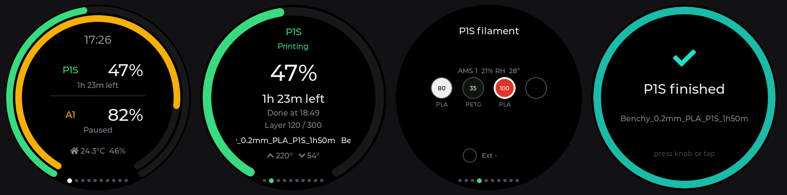

# Bambu Monitor

You start a four-hour print, walk away, and then keep picking up your phone to check how
it's doing. I did that with two printers, an A1 and an X2D. So I turned a
[LilyGO T-Encoder-Pro](https://lilygo.cc/products/t-encoder-pro) into a little round dashboard
that sits on my desk and tells me.



It talks to up to **two Bambu Lab printers directly over your Wi-Fi**. No cloud account,
no Home Assistant. Your printers can stay on Bambu Cloud.

## What you get

- Both printers at a glance: progress rings, time left, "Done at 18:49"
- Temperatures, fans, AMS spools in their real colours, HMS errors
- A loud, pulsing alert when a print finishes, pauses for a runout or fails
- Pause, resume, stop, speed and chamber light from the knob
- Every bit of the hardware used: knob, touch, speaker and optional Qwiic sensors for room
  climate and auto-brightness

## Install it in two minutes

1. Open the **[web flasher](https://bnap00.github.io/bambu-monitor/)** in Chrome or Edge.
2. Plug in the T-Encoder-Pro and click *Install*.
3. Scan the QR code on the screen, then enter your Wi-Fi and, for each printer, its IP,
   serial number and LAN access code (on the printer under *Settings → WLAN*).

That's it. Later updates install over Wi-Fi.

## Driving it

The whole screen is the knob's button.

| Do this | Result |
|---|---|
| Turn | Next page |
| Press | Menu |
| Double-press | Other printer |
| Hold | Home |

Swipes work too. The [guide](docs/guide.md) has the full controls, alerts, settings, the status
API and troubleshooting.

## Will it work with my printer?

Tested on the A1 and X2D. Every other Bambu printer speaks the same LAN protocol, so it
should work. If yours misbehaves,
[open an issue](https://github.com/bnap00/bambu-monitor/issues/new?template=printer_support.md).

Newer printer firmware may ignore pause and stop over LAN unless *Developer Mode* is on.
Watching always works.

## Hack on it

```bash
pip install platformio
pio run -e t-encoder-pro -t upload
```

I built most of the UI without touching the device. `test/sim` renders the real screens on a
PC, and a stress test spins the knob 20,000 times. That's how a reboot-on-fast-spin bug in LVGL
got caught. See [CONTRIBUTING.md](CONTRIBUTING.md).

## The fine print

[MIT licensed](LICENSE). Third-party bits are in [THIRD_PARTY_NOTICES.md](THIRD_PARTY_NOTICES.md).
Access codes are stored unencrypted on the device. Read [SECURITY.md](SECURITY.md) before
putting it on a shared network. Not affiliated with Bambu Lab or LilyGO.

---

A knob with a screen turned out to be a better print monitor than the app on my phone.
It doesn't do much. It shows you what's happening, and it beeps when something needs you.

Feel free to reach out on [bnap.dev](https://bnap.dev) or open an issue if you have questions.
